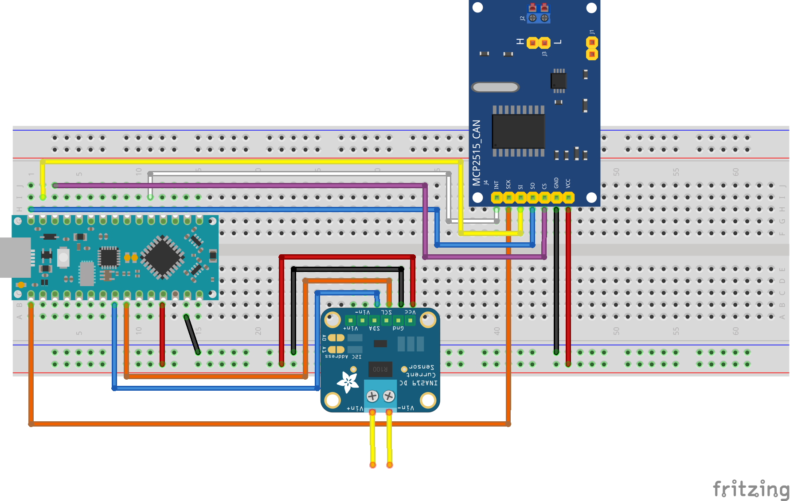
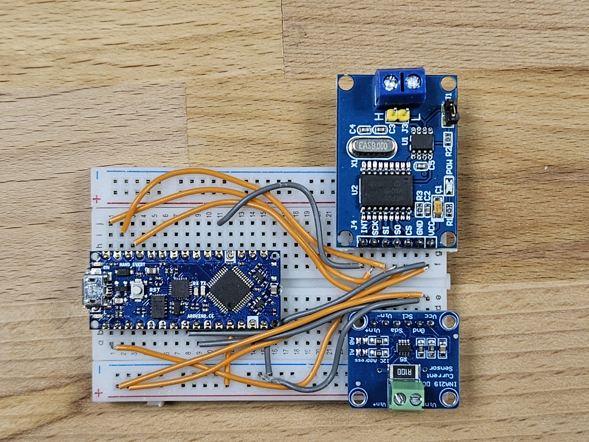
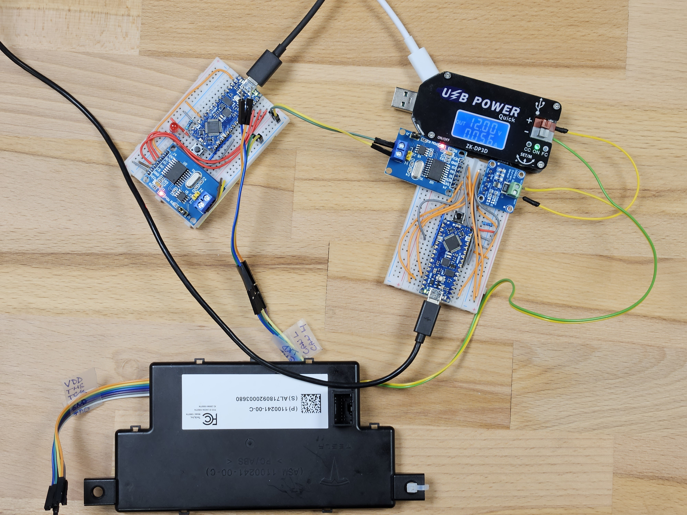

# CAN DLC Fuzzer

This repository contains code for simple fuzzer that is sending arbitrary DLC value in search for the possible buffer overflow. As an optional feature, it leverages access to the current sensor to automatically detect potential crashes. 
## Hardware
The fuzzer is implemented with following components:
* Arduino Nano Every
* IN219 Current Sensor
* MCP2515 CAN Bus Controller
* Breadboard (for better comfort we suggest using the bigger version of it)
* Wires

Those components should be connected based on the diagram below:

Actual implementation can look a bit chaotic if you decide to use the smaller breadboard:

## Usage

Upload the sketch to Arduino (note that only external dependency is on the [Adafruit INA219 library](https://github.com/adafruit/Adafruit_INA219)). Adjusted `autowp_mcp2515` library is included (All credits for its implementation goes to [its authors](https://github.com/autowp/arduino-mcp2515)).

Once uploaded, use your favorite terminal for connecting to serial interfaces and follow the series of questions asked:

* `[?] Do you want to use the INA 219 current sensor to detect potential crashes? [Y/N]` - Use `Y`/`y` if you want to use current sensor for crash detection. `N`/`n` if you do not want this.
* `[?] What CAN bus speed you want to use (Use the number in square brackets from the list below to make a choice)?` - Send the number form square brackets that corresponds to the desired CAN bus speed.
* `[?] Do you have a set of IDs that should be used (Answering [N] means brute-force attack)? [Y/N]` - If you want to use a predefined list of CAN IDs that should be attempted answer `Y`/`y`, using `N`/`n` means a pure brute-force with all IDs (be aware that extended CAN ID space is very large and it will take unholy amount of time to complete, ideally use brute-force only with standard 11-bit IDs).
* If answer to the previous question was `Y`/`y`:
  * `[?] How many CAN IDs will be used?` - Simply send number of CAN IDs that you want to try.
  * `[*] Enter the CAN ID in hex format separated with comma (\"0x100,0x101,0x102,...\")` - Enter the CAN ID values with comma separation, for example: `0x100,0x101,0x102`
* If the answer was `N`/`n`:
  * `[?] Do you want to use [S]tandard or [E]xtended CAN IDs (Note that Extended CAN ID brute-force will take insanely long)?` - Use `E`/`e` for extended CAN ID brute-force and `S`/`s` for standard 11-bit IDs.

After this initial setup, the device will either start brute-forcing, or will enter the learning process for the current consumption via the INA 219 sensor.

## Fuzzer in action

An example of the fuzzer in action on the target as presented at Car Hacking Village at DEFCON31 is shown in the image below. 

The setup in the terminal and the execution log is recorded demonstrated here:

